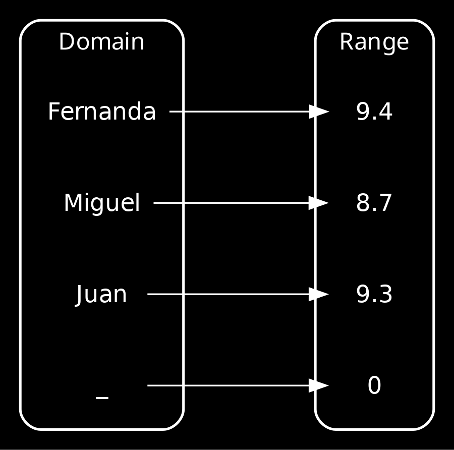

# Commands
These are the four commands that are evaluated, you can run them locally. To solve the errors faster.
- Validate format
```bash
# Linux & Windows
elm-format src/ --validate
```
- Run checks
```bash
# Linux
elm-review --template jfmengels/elm-review-common/example --rules NoMissingTypeAnnotation,NoMissingTypeAnnotationInLetIn
# Windows Powershell
elm-review --template jfmengels/elm-review-common/example --rules "NoMissingTypeAnnotation,NoMissingTypeAnnotationInLetIn"
# Windows cmd
elm-review --template jfmengels/elm-review-common/example --rules NoMissingTypeAnnotation,NoMissingTypeAnnotationInLetIn
```
- Build
```bash
# Linux
elm make src/*
# Windows
elm make src/<file>.elm
```
- Run tests
```bash
# Linux & Windows
elm-test
```

## Prerequisites
- NodeJs
- Elm
- elm-test 
- elm-format
- elm-review


### Coding
<!-- column_layout: [1,1] -->
<!-- column: 0 -->
Let's create a file "Helper.elm" in the "src" folder.
```elm
-- File: Ex1-functions/src/Helper
module Helper exposing (..)

double : number -> number
double x =
    x * 2

```
<!-- pause -->
<!-- column: 1 -->
Let's make sure our terminal is at "Ex1-functions" (pwd)
```bash
pwd
elm repl
```
REPL stands for Read Eval Print Loop
```bash
import Helper

Helper.double

Helper.double 4

:exit
```

<!-- reset_layout -->
<!-- end_slide -->
### More functions
1. A new function "square" that takes a number and square's it (x^2)
<!-- new_line -->
2. A new function called "Greet" so that it receives a String name and return "Hello " + name
<!-- new_line -->
3. A new function "above5 : number -> Bool" that evaluates if a given number is greater than (>) 5
<!-- end_slide -->
<!-- jump_to_middle -->
#### If
#### More functions
1. A new function "ifBoolTranslate" that get's a Bool and return a String either "Positivo" or "Negativo"
<!-- new_line -->
2. A new function "ifNumberSign" that get's a number and return a string either "Positive", "Negative", "Neutral"
<!-- new_line -->

<!-- end_slide -->

<!-- jump_to_middle -->
##### Case
<!-- end_slide -->
##### More functions
<!-- column_layout: [1,1] -->
<!-- column: 0 -->
1. A new function "getNameById" that get's an Int and return a String


<!-- column: 1 -->
2. A new function "getGradeByName" that get's a String and return a Float 



